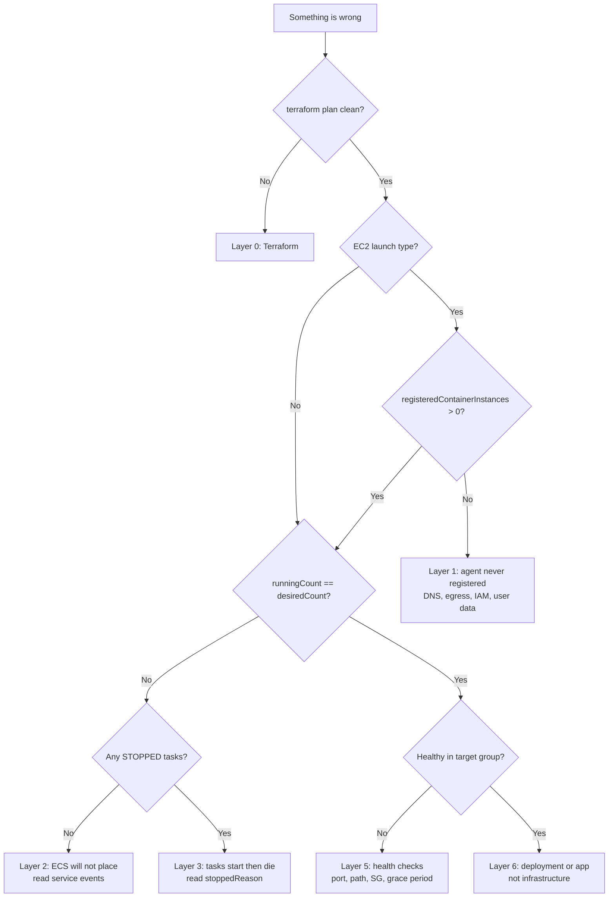

# ECS Debugging Guide

A command reference for diagnosing ECS problems in clusters built by this
module. Organised by layer, because **the order you check things in matters more
than the commands themselves** — most wasted hours come from debugging the task
when the container instance never registered.

- [Setup: variables every command uses](#setup-variables-every-command-uses)
- [Triage: start here](#triage-start-here)
- [Symptom index](#symptom-index)
- [Layer 0: Terraform](#layer-0-terraform)
- [Layer 1: cluster and capacity](#layer-1-cluster-and-capacity)
- [Layer 2: service](#layer-2-service)
- [Layer 3: task](#layer-3-task)
- [Layer 4: networking](#layer-4-networking)
- [Layer 5: load balancer](#layer-5-load-balancer)
- [Layer 6: deployments](#layer-6-deployments)
- [Service Connect](#service-connect)
- [Autoscaling](#autoscaling)
- [IAM](#iam)
- [Logs](#logs)
- [ECS Exec: getting inside a task](#ecs-exec-getting-inside-a-task)
- [Emergency actions](#emergency-actions)
- [What this module names things](#what-this-module-names-things)

Related: [`USER_GUIDE.md`](./USER_GUIDE.md) for configuration,
[`examples/RUNBOOK.md`](./examples/RUNBOOK.md) for per-example walkthroughs.

---

## Setup: variables every command uses

Run this once. Every snippet below assumes these.

```bash
export AWS_REGION=us-east-2
export CLUSTER=$(terraform output -raw cluster_name)
export SVC=$(terraform output -json service_name | jq -r '.app')   # your container_config key
export ALIAS=$(aws iam list-account-aliases --query 'AccountAliases[0]' --output text)
```

If `ALIAS` comes back `None`, **stop** — this module prefixes every resource
name with the account alias. Without one, names are malformed and nothing else
here will line up.

Useful derived values:

```bash
export FAMILY="${ALIAS}-app"                    # task definition family
export TASK=$(aws ecs list-tasks --cluster "$CLUSTER" --service-name "$SVC" \
  --query 'taskArns[0]' --output text)
```

Handy one-liner to see everything the module exposed:

```bash
terraform output
terraform output -json service_deployment_summary | jq
```

`service_deployment_summary` is the fastest way to confirm what the module
*actually resolved* — launch type, network mode, strategy, controller — as
opposed to what you think you configured. `container_config` is typed `any`, so
a misspelled key is silently ignored rather than rejected.

---

## Triage: start here



The single most diagnostic command, for EC2 clusters:

```bash
aws ecs describe-clusters --clusters "$CLUSTER" \
  --query 'clusters[0].{registered:registeredContainerInstancesCount,running:runningTasksCount,pending:pendingTasksCount,active:activeServicesCount}'
```

**`registered: 0` with EC2 instances in the console means the ECS agent never
registered.** No `desired_count` will ever be satisfied. Go straight to Layer 1
and do not look at the task.

---

## Symptom index

| Symptom | Most likely cause | Section |
| --- | --- | --- |
| Tasks stay `PENDING` forever, EC2 | Agent never registered — usually DNS egress | [Layer 1](#layer-1-cluster-and-capacity) |
| "unable to place a task because no container instance met all of its requirements" | Subnet mismatch, memory, host port, ENI limit, placement constraint | [Layer 2](#why-ecs-will-not-place-a-task) |
| `CannotPullContainerError` | No route to ECR, or execution role cannot read the repo | [Layer 3](#image-pull-failures) |
| `ResourceInitializationError` on secrets | Execution role missing `secretsmanager` / `ssm` permissions | [IAM](#iam) |
| Task starts, then stops seconds later | Application crash — read app logs, not ECS | [Layer 3](#exit-codes) |
| Task `RUNNING` but target group `unhealthy` | Health check path/port, SG, or grace period too short | [Layer 5](#target-group-health) |
| Deployment stuck `IN_PROGRESS` | Failing health checks; circuit breaker disabled | [Layer 6](#deployment-stuck) |
| Deployment "succeeds" but shifts no traffic | Missing `alternate_target_group_arn` / `production_listener_rule` | [Layer 6](#traffic-shifting-did-not-happen) |
| Listener weights revert on next apply | Listener rule missing `ignore_changes = [action]` | [Layer 6](#traffic-shifting-did-not-happen) |
| Deployment sits at one weight for minutes | That is the bake, not a hang | [Layer 6](#reading-a-gradual-rollout) |
| `awsvpc` tasks stop scheduling with memory free | One ENI per task — trunking limit | [Layer 4](#eni-exhaustion-awsvpc-on-ec2) |
| `bridge` tasks will not scale past one per instance | Fixed `hostPort`; use `0` | [Layer 4](#host-port-conflicts-bridge) |
| Rolling deploy deadlocks on full EC2 cluster | `minimum_healthy_percent = 100` | [Layer 6](#deployment-stuck) |
| Service Connect name does not resolve | Backend not redeployed, or `port_name` mismatch | [Service Connect](#service-connect) |
| `terraform plan` wants to change `desired_count` | Expected — module ignores it | [Layer 0](#expected-plan-noise) |
| Every resource name looks wrong | No account alias set | [Setup](#setup-variables-every-command-uses) |

---

## Layer 0: Terraform

Before blaming AWS, confirm the config is what you think.

```bash
terraform validate
terraform fmt -check -recursive
terraform plan -out=tfplan
terraform show -json tfplan | jq '.resource_changes[] | select(.change.actions[0] != "no-op") | {addr:.address, action:.change.actions}'
```

### This module's own guardrails

It fails early on the misconfigurations that otherwise apply cleanly and break
at runtime. If the plan errors with one of these, the message names the fix:

- `deployment_controller.type must be ECS or EXTERNAL` — CodeDeploy is gone.
- `must set both alternate_target_group_arn and production_listener_rule` — a
  traffic-shifting strategy that would silently degrade to a rolling replace.
- `runs awsvpc on EC2, but these task subnets have no container instances
  behind them` — the subnet mismatch, caught at plan.
- `step_percent must be between 1 and 100`, negative bake times, etc.

**Warnings matter too.** `check` blocks report at plan without failing it:

```bash
terraform plan 2>&1 | grep -A5 "Warning:"
```

These cover the cases a hard error cannot reach — a service inheriting a
shifting strategy from `deployment_strategy_default`, a traffic-shifting service
that is not load balanced, and `bridge`/`host` services setting `subnets` or
`security_groups` (which are silently ignored).

### Inspect resolved values without applying

```bash
terraform console
> local.svc_resolved
> local.svc_instance_subnets
> local.ec2_capacity_provider_names
```

### Expected plan noise

These are **not** bugs:

| Diff | Why |
| --- | --- |
| `desired_count` | Owned by Application Auto Scaling; module sets `ignore_changes` |
| ASG `desired_capacity` | Owned by ECS managed scaling |
| `task_definition` on a service | Only if you set `ignore_task_definition_changes = true` |
| New task definition revision every apply | Normal — ECS task definitions are immutable |

### State inspection

```bash
terraform state list | grep ecs
terraform state show 'module.ecs.aws_ecs_service.main["app"]'
terraform state show 'module.ecs.aws_ecs_task_definition.main["app"]'
```

---

## Layer 1: cluster and capacity

Skip this entire section on Fargate — there is no capacity to manage.

### Is the cluster there?

```bash
aws ecs describe-clusters --clusters "$CLUSTER" \
  --include ATTACHMENTS SETTINGS STATISTICS \
  --query 'clusters[0].{name:clusterName,status:status,registered:registeredContainerInstancesCount,running:runningTasksCount,pending:pendingTasksCount}'
```

### Are the capacity providers attached?

```bash
aws ecs describe-clusters --clusters "$CLUSTER" \
  --query 'clusters[0].{providers:capacityProviders,default:defaultCapacityProviderStrategy}'

aws ecs describe-capacity-providers \
  --capacity-providers "$(terraform output -json capacity_provider_names | jq -r '.[]')" \
  --query 'capacityProviders[].{name:name,status:status,managedScaling:autoScalingGroupProvider.managedScaling,draining:autoScalingGroupProvider.managedDraining}'
```

A provider must be **associated with the cluster** before any service can name
it in a strategy. The module handles that via
`aws_ecs_cluster_capacity_providers`.

### Did instances launch at all?

```bash
ASG=$(terraform output -json container_instance_autoscaling_group_names | jq -r '.[]' | head -1)

aws autoscaling describe-auto-scaling-groups --auto-scaling-group-names "$ASG" \
  --query 'AutoScalingGroups[0].{desired:DesiredCapacity,min:MinSize,max:MaxSize,subnets:VPCZoneIdentifier,instances:Instances[].{id:InstanceId,state:LifecycleState,health:HealthStatus,az:AvailabilityZone}}'
```

Instances launching and terminating in a loop:

```bash
aws autoscaling describe-scaling-activities --auto-scaling-group-name "$ASG" \
  --max-items 10 --query 'Activities[].{time:StartTime,status:StatusCode,cause:Cause}' --output table
```

### Did they register?

```bash
aws ecs list-container-instances --cluster "$CLUSTER" --query 'containerInstanceArns' --output text \
  | xargs -r aws ecs describe-container-instances --cluster "$CLUSTER" --container-instances \
  --query 'containerInstances[].{id:ec2InstanceId,status:status,agent:agentConnected,version:versionInfo.agentVersion,running:runningTasksCount,pending:pendingTasksCount}' \
  --output table
```

**Running EC2 instances with zero registered container instances is the single
most common EC2 failure.** In order of likelihood:

| Cause | Check |
| --- | --- |
| **No DNS egress** | SG must allow UDP **and** TCP 53 to the VPC CIDR. Terraform strips AWS's default allow-all egress, so 443-only is a very easy mistake |
| No HTTPS egress | TCP 443 out, or the full set of VPC endpoints |
| Clock skew | UDP 123 out; skew breaks TLS and looks exactly like a network failure |
| Instance IAM | `AmazonEC2ContainerServiceforEC2Role` must be attached |
| User data | `ECS_CLUSTER=` must be written to `/etc/ecs/ecs.config` |
| Wrong AMI | Must be ECS-optimized, or have the agent installed |

Check the security group the module created:

```bash
SG=$(terraform output -json container_instance_security_group_ids | jq -r '.[]' | head -1)

aws ec2 describe-security-group-rules --filters Name=group-id,Values="$SG" \
  --query 'SecurityGroupRules[].{egress:IsEgress,proto:IpProtocol,from:FromPort,to:ToPort,cidr:CidrIpv4,sg:ReferencedGroupInfo.GroupId}' \
  --output table
```

You want to see **four egress rules**: 443/tcp, 53/udp, 53/tcp, 123/udp. If you
only see 443, that is your bug.

### On the instance itself

```bash
INSTANCE=$(aws ecs list-container-instances --cluster "$CLUSTER" --query 'containerInstanceArns[0]' --output text)
# or straight from the ASG if nothing registered:
INSTANCE=$(aws autoscaling describe-auto-scaling-groups --auto-scaling-group-names "$ASG" \
  --query 'AutoScalingGroups[0].Instances[0].InstanceId' --output text)

aws ssm start-session --target "$INSTANCE"
```

Then, in order:

```bash
# 1. DNS. If this fails, nothing else matters.
getent hosts ecs.us-east-2.amazonaws.com

# 2. Reachability.
curl -sS -o /dev/null -w '%{http_code}\n' https://ecs.us-east-2.amazonaws.com

# 3. Clock.
timedatectl status

# 4. Did user data run?
cat /etc/ecs/ecs.config
sudo cat /var/log/cloud-init-output.log | tail -40

# 5. The agent.
sudo systemctl status ecs
sudo tail -100 /var/log/ecs/ecs-agent.log
sudo tail -50 /var/log/ecs/ecs-init.log

# 6. Instance identity / IAM.
curl -sH "X-aws-ec2-metadata-token: $(curl -sX PUT http://169.254.169.254/latest/api/token \
  -H 'X-aws-ec2-metadata-token-ttl-seconds: 60')" \
  http://169.254.169.254/latest/meta-data/iam/security-credentials/
```

If SSM itself will not connect, that is the same egress problem — SSM needs 443
and DNS too.

### Remaining capacity

```bash
aws ecs list-container-instances --cluster "$CLUSTER" --query 'containerInstanceArns' --output text \
  | xargs -r aws ecs describe-container-instances --cluster "$CLUSTER" --container-instances \
  --query 'containerInstances[].{id:ec2InstanceId,remaining:remainingResources,registered:registeredResources}'
```

Read `remainingResources` for `CPU`, `MEMORY`, `PORTS` and — critically for
`awsvpc` — `ENI`. See [Layer 4](#eni-exhaustion-awsvpc-on-ec2).

---

## Layer 2: service

### Service state and events

Service events are where ECS explains itself. Always read them first.

```bash
aws ecs describe-services --cluster "$CLUSTER" --services "$SVC" \
  --query 'services[0].{status:status,desired:desiredCount,running:runningCount,pending:pendingCount,launchType:launchType,strategy:capacityProviderStrategy,controller:deploymentController.type}'

aws ecs describe-services --cluster "$CLUSTER" --services "$SVC" \
  --query 'services[0].events[:10].[createdAt,message]' --output text
```

Watch them live:

```bash
watch -n 10 "aws ecs describe-services --cluster $CLUSTER --services $SVC \
  --query 'services[0].{d:desiredCount,r:runningCount,p:pendingCount}' --output table"
```

### Why ECS will not place a task

The message *"unable to place a task because no container instance met all of
its requirements"* has a specific cause every time:

| Cause | How to confirm |
| --- | --- |
| **awsvpc subnet mismatch** | Compare `service.subnets` against the subnets instances are in. The module now blocks this at plan, but an older state can still be broken |
| Not enough memory/CPU | `remainingResources` on each instance |
| Host port conflict | `remainingResources[].PORTS` — a fixed `hostPort` allows one task per instance |
| ENI limit | `remainingResources[].ENI` is 0 |
| Placement constraint | `describe-task-definition --query 'taskDefinition.placementConstraints'` |
| Wrong CPU architecture | ARM task definition on x86 instances, or vice versa |

Compare the subnets directly:

```bash
# Where instances actually are
aws ecs list-container-instances --cluster "$CLUSTER" --query 'containerInstanceArns' --output text \
  | xargs -r aws ecs describe-container-instances --cluster "$CLUSTER" --container-instances \
  --query 'containerInstances[].ec2InstanceId' --output text \
  | xargs -r aws ec2 describe-instances --instance-ids \
  --query 'Reservations[].Instances[].{id:InstanceId,subnet:SubnetId,az:Placement.AvailabilityZone}' --output table

# Where the service wants task ENIs
aws ecs describe-services --cluster "$CLUSTER" --services "$SVC" \
  --query 'services[0].networkConfiguration.awsvpcConfiguration.subnets'
```

Any subnet in the second list that is absent from the first is unplaceable.

---

## Layer 3: task

### Running tasks

```bash
aws ecs list-tasks --cluster "$CLUSTER" --service-name "$SVC" --desired-status RUNNING \
  --query 'taskArns' --output text \
  | xargs -r aws ecs describe-tasks --cluster "$CLUSTER" --tasks \
  --query 'tasks[].{id:taskArn,last:lastStatus,desired:desiredStatus,health:healthStatus,cp:capacityProviderName,started:startedAt}' \
  --output table
```

### Stopped tasks — the most useful single query

`stoppedReason` is almost always the answer. Stopped tasks are retained for
about an hour, so grab it quickly.

```bash
aws ecs list-tasks --cluster "$CLUSTER" --service-name "$SVC" --desired-status STOPPED \
  --query 'taskArns' --output text \
  | xargs -r aws ecs describe-tasks --cluster "$CLUSTER" --tasks \
  --query 'tasks[].{stopped:stoppedReason,code:stopCode,at:stoppedAt,containers:containers[].{name:name,exit:exitCode,reason:reason}}'
```

### Exit codes

| Exit code | Meaning |
| --- | --- |
| `0` | Clean exit. For a long-running service this still stops the task — the process should not return |
| `1` | Application error — read the app logs |
| `137` | SIGKILL — **almost always OOM**, or a failed stop timeout |
| `139` | Segfault |
| `143` | SIGTERM — normal during a deployment or scale-in |

`137` with `OutOfMemoryError: Container killed due to memory usage` means the
container exceeded its hard `memory` limit. Raise `memory`, or lower the app's
heap.

### Image pull failures

```bash
aws ecs describe-tasks --cluster "$CLUSTER" --tasks "$TASK" \
  --query 'tasks[0].containers[].{name:name,reason:reason}'
```

| Message | Cause |
| --- | --- |
| `CannotPullContainerError: ... i/o timeout` | No route to ECR — missing NAT, or missing `ecr.api`/`ecr.dkr`/S3 endpoints |
| `CannotPullContainerError: ... no basic auth credentials` | Execution role missing ECR permissions |
| `CannotPullContainerError: ... not found` | Bad image tag |
| `ResourceInitializationError: unable to pull secrets` | Execution role missing `secretsmanager:GetSecretValue` or `ssm:GetParameters`, or no route to those endpoints |

Note the distinction: **the execution role pulls the image and fetches secrets;
the task role is what your application code uses.** Image pull failures are
always the execution role.

### Task definition

```bash
aws ecs describe-task-definition --task-definition "$FAMILY" \
  --query 'taskDefinition.{family:family,rev:revision,net:networkMode,cpu:cpu,memory:memory,compat:requiresCompatibilities,exec:executionRoleArn,task:taskRoleArn}'

# Container-level detail
aws ecs describe-task-definition --task-definition "$FAMILY" \
  --query 'taskDefinition.containerDefinitions[].{name:name,image:image,cpu:cpu,mem:memory,memRes:memoryReservation,ports:portMappings,log:logConfiguration.options}'
```

List revisions to see what changed:

```bash
aws ecs list-task-definitions --family-prefix "$FAMILY" --sort DESC --max-items 5
```

Diff two revisions:

```bash
diff <(aws ecs describe-task-definition --task-definition "$FAMILY:41" --query 'taskDefinition.containerDefinitions' | jq -S .) \
     <(aws ecs describe-task-definition --task-definition "$FAMILY:42" --query 'taskDefinition.containerDefinitions' | jq -S .)
```

---

## Layer 4: networking

### Which mode am I actually in?

```bash
terraform output -json service_deployment_summary | jq '.[] | {launch_type, network_mode}'
```

### awsvpc

```bash
aws ecs describe-services --cluster "$CLUSTER" --services "$SVC" \
  --query 'services[0].networkConfiguration.awsvpcConfiguration'
```

Find the ENI for a running task and test from it:

```bash
ENI=$(aws ecs describe-tasks --cluster "$CLUSTER" --tasks "$TASK" \
  --query "tasks[0].attachments[0].details[?name=='networkInterfaceId'].value | [0]" --output text)

aws ec2 describe-network-interfaces --network-interface-ids "$ENI" \
  --query 'NetworkInterfaces[0].{ip:PrivateIpAddress,subnet:SubnetId,sgs:Groups[].GroupId,public:Association.PublicIp}'
```

### ENI exhaustion (awsvpc on EC2)

Each `awsvpc` task consumes one ENI. A `t3.medium` has 3, an `m6i.large` 3 — so
roughly two to three tasks per instance regardless of free CPU and memory, and
the rest sit `PENDING` with no obvious cause.

```bash
aws ecs list-container-instances --cluster "$CLUSTER" --query 'containerInstanceArns' --output text \
  | xargs -r aws ecs describe-container-instances --cluster "$CLUSTER" --container-instances \
  --query "containerInstances[].{id:ec2InstanceId,eni:remainingResources[?name=='ENI'].remainingValue|[0],mem:remainingResources[?name=='MEMORY'].remainingValue|[0]}" \
  --output table
```

`eni: 0` with plenty of `mem` is the trunking limit. Fix with
`enable_eni_trunking = true` on the capacity provider **and** the account
setting:

```bash
aws ecs put-account-setting-default --name awsvpcTrunking --value enabled
aws ecs list-account-settings --effective-settings
```

Existing instances must be replaced for it to take effect.

### Host port conflicts (bridge)

```bash
aws ecs list-container-instances --cluster "$CLUSTER" --query 'containerInstanceArns' --output text \
  | xargs -r aws ecs describe-container-instances --cluster "$CLUSTER" --container-instances \
  --query "containerInstances[].{id:ec2InstanceId,ports:remainingResources[?name=='PORTS'].stringSetValue|[0]}"
```

A fixed `hostPort` caps you at one task per instance. Use `hostPort = 0` for an
ephemeral port.

### Security groups

```bash
# What the task ENI allows in
aws ec2 describe-security-group-rules --filters Name=group-id,Values="<task-sg>" \
  --query 'SecurityGroupRules[?!IsEgress].{proto:IpProtocol,from:FromPort,to:ToPort,src:CidrIpv4,srcSg:ReferencedGroupInfo.GroupId}' --output table
```

Rules of thumb:

- **awsvpc + ALB** — ALB SG → task SG on the **container port**.
- **bridge + ALB** — ALB SG → instance SG on the **ephemeral range 32768-65535**,
  not the container port.
- **Service Connect** — caller SG → callee SG on the container port, or on
  `ingress_port_override` if set.

### Connectivity, end to end

```bash
# Route table for the task subnet — is there actually a NAT?
aws ec2 describe-route-tables --filters Name=association.subnet-id,Values="<subnet>" \
  --query 'RouteTables[].Routes[].{dest:DestinationCidrBlock,nat:NatGatewayId,igw:GatewayId,vpce:GatewayId}'

# VPC endpoints present
aws ec2 describe-vpc-endpoints --filters Name=vpc-id,Values="<vpc>" \
  --query 'VpcEndpoints[].{svc:ServiceName,type:VpcEndpointType,state:State}' --output table

# Reachability Analyzer — definitive answer for "can A reach B"
aws ec2 create-network-insights-path --source "<eni-or-instance>" --destination "<target>" \
  --protocol tcp --destination-port 443
```

---

## Layer 5: load balancer

### Target group health

```bash
TG="<target-group-arn>"

aws elbv2 describe-target-health --target-group-arn "$TG" \
  --query 'TargetHealthDescriptions[].{id:Target.Id,port:Target.Port,state:TargetHealth.State,reason:TargetHealth.Reason,desc:TargetHealth.Description}' \
  --output table
```

| `Reason` | Cause |
| --- | --- |
| `Target.FailedHealthChecks` | App not answering the health path, or wrong port |
| `Target.NotRegistered` | ECS has not registered it yet, or `target_type` mismatch |
| `Target.Timeout` | Security group blocks the LB, or app too slow |
| `Target.ResponseCodeMismatch` | App answers, but not with the expected status |
| `Elb.InitialHealthChecking` | Still in the grace period — wait |

### Check the target group's own settings

```bash
aws elbv2 describe-target-groups --target-group-arns "$TG" \
  --query 'TargetGroups[0].{type:TargetType,port:Port,proto:Protocol,path:HealthCheckPath,hcPort:HealthCheckPort,interval:HealthCheckIntervalSeconds,matcher:Matcher.HttpCode}'
```

**`TargetType` must match the network mode** — `ip` for `awsvpc`, `instance` for
`bridge`/`host`. This is the most common EC2 wiring mistake and it fails at
apply, not at plan.

### Grace period

A slow-booting app inside `health_check_grace_period_seconds` gets killed and
restarted forever, which looks like a crash loop. Raise it:

```bash
aws ecs describe-services --cluster "$CLUSTER" --services "$SVC" \
  --query 'services[0].healthCheckGracePeriodSeconds'
```

---

## Layer 6: deployments

### Current deployment state

```bash
aws ecs describe-services --cluster "$CLUSTER" --services "$SVC" \
  --query 'services[0].deployments[].{status:status,rollout:rolloutState,reason:rolloutStateReason,desired:desiredCount,running:runningCount,pending:pendingCount,td:taskDefinition}' \
  --output table
```

### The newer deployment APIs

These give far more than `describe-services` for ECS-native strategies:

```bash
aws ecs list-service-deployments --cluster "$CLUSTER" --service "$SVC" \
  --query 'serviceDeployments[].{arn:serviceDeploymentArn,status:status,started:startedAt}' --output table

DEP=$(aws ecs list-service-deployments --cluster "$CLUSTER" --service "$SVC" \
  --query 'serviceDeployments[0].serviceDeploymentArn' --output text)

aws ecs describe-service-deployments --service-deployment-arns "$DEP"

# What revisions exist and what each is running
aws ecs list-service-revisions --cluster "$CLUSTER" --service "$SVC"
```

`describe-service-deployments` reports the current stage, which revision holds
what share of traffic, and — on failure — exactly why it rolled back.

### Deployment stuck

```bash
aws ecs describe-services --cluster "$CLUSTER" --services "$SVC" \
  --query 'services[0].deployments[].{rollout:rolloutState,reason:rolloutStateReason}'
```

| Cause | Fix |
| --- | --- |
| Failing health checks, circuit breaker off | Enable `deployment_circuit_breaker` so ECS gives up and rolls back |
| `minimum_healthy_percent = 100` on a full EC2 cluster | ECS cannot free host ports to place replacements. Use `50` |
| No capacity | Raise ASG `max_size`, or lower `managed_scaling_target_capacity` for headroom |
| Waiting on a lifecycle hook | The hook Lambda never returned — check its logs |

### Reading a gradual rollout

The live traffic split lives on the **listener rule**, not in ECS. The module
does not create listener rules, so get the ARN from wherever you do — the
`gradual-deployment` example exposes it as `production_listener_rule_arns`,
otherwise read it off the service:

```bash
RULE=$(aws ecs describe-services --cluster "$CLUSTER" --services "$SVC" \
  --query 'services[0].loadBalancers[0].advancedConfiguration.productionListenerRule' --output text)

aws elbv2 describe-rules --rule-arns "$RULE" \
  --query 'Rules[0].Actions[0].ForwardConfig.TargetGroups[].{tg:TargetGroupArn,weight:Weight}' --output table
```

Watch it shift:

```bash
watch -n 15 "aws elbv2 describe-rules --rule-arns $RULE \
  --query 'Rules[0].Actions[0].ForwardConfig.TargetGroups[].[TargetGroupArn,Weight]' --output text"
```

**A weight that does not move for minutes is the bake working, not a hang.**
`LINEAR` at 20%/3min takes ~15 minutes plus the final bake; `CANARY` with a
15-minute canary bake takes ~20.

### Traffic shifting did not happen

The deployment reported success but weights never moved:

```bash
# Does the service actually have advanced configuration?
aws ecs describe-services --cluster "$CLUSTER" --services "$SVC" \
  --query 'services[0].loadBalancers[].{tg:targetGroupArn,alt:advancedConfiguration.alternateTargetGroupArn,prodRule:advancedConfiguration.productionListenerRule,role:advancedConfiguration.roleArn}'

# And what strategy did it resolve to?
aws ecs describe-services --cluster "$CLUSTER" --services "$SVC" \
  --query 'services[0].deploymentConfiguration'
```

`alt: null` means `advanced_configuration` was never emitted — the service is
missing `alternate_target_group_arn`. The module blocks this at plan now, but a
service that inherited its strategy from `deployment_strategy_default` only gets
a **warning**, so re-read your plan output.

If weights move during the deployment and then **revert on the next
`terraform apply`**, your listener rule is missing:

```hcl
lifecycle { ignore_changes = [action] }
```

### Alarm-based rollback

```bash
aws cloudwatch describe-alarms \
  --alarm-names $(terraform output -json alarm_names_for_rollback | jq -r '.[][]') \
  --query 'MetricAlarms[].{name:AlarmName,state:StateValue,reason:StateReason}' --output table

aws cloudwatch describe-alarm-history --alarm-name "${ALIAS}-app-cpu-high" \
  --history-item-type StateUpdate --max-records 10 \
  --query 'AlarmHistoryItems[].{at:Timestamp,summary:HistorySummary}'
```

Remember alarms must **exist before** a deployment can reference them — that is
why enabling rollback is a two-apply sequence.

---

## Service Connect

```bash
aws ecs describe-services --cluster "$CLUSTER" --services "$SVC" \
  --query 'services[0].serviceConnectConfiguration'

# What is actually registered in Cloud Map
aws servicediscovery list-services \
  --query 'Services[].{name:Name,id:Id,ns:NamespaceId}' --output table

aws servicediscovery list-instances --service-id "<id>" \
  --query 'Instances[].{id:Id,attrs:Attributes}'
```

| Symptom | Cause |
| --- | --- |
| Name does not resolve from the client | Client task predates the endpoint — **redeploy the client** |
| Service did not register | `port_name` does not match any `port_mappings[].name` |
| Connection refused | Callee SG does not allow the caller on the container port |
| ALB traffic behaving oddly | In `awsvpc`, ALB traffic routes through the SC agent by default — set `ingress_port_override` on the `services[]` entry |

Rollout order is not optional: **backend first, then redeploy the client.**
Existing tasks do not learn new endpoints without a redeploy.

Test from inside a task:

```bash
aws ecs execute-command --cluster "$CLUSTER" --task "$TASK" --container app \
  --interactive --command "sh -c 'getent hosts api; curl -sv http://api:8080/health'"
```

The Service Connect proxy logs to the same task's log group under the
`ecs-service-connect` container.

---

## Autoscaling

```bash
RES="service/${CLUSTER}/${SVC}"

aws application-autoscaling describe-scalable-targets \
  --service-namespace ecs --resource-ids "$RES" \
  --query 'ScalableTargets[].{min:MinCapacity,max:MaxCapacity,role:RoleARN}'

aws application-autoscaling describe-scaling-policies \
  --service-namespace ecs --resource-id "$RES" \
  --query 'ScalingPolicies[].{name:PolicyName,type:PolicyType,target:TargetTrackingScalingPolicyConfiguration.TargetValue}' --output table

aws application-autoscaling describe-scaling-activities \
  --service-namespace ecs --resource-id "$RES" --max-results 10 \
  --query 'ScalingActivities[].{at:StartTime,status:StatusCode,cause:Cause,detail:StatusMessage}' --output table
```

| Symptom | Cause |
| --- | --- |
| Never scales out | Metric never crosses target; check the alarms the policy created |
| Scales but tasks stay `PENDING` | Not an autoscaling problem — no capacity. See Layer 1 |
| Flapping | Cooldowns too short, or CPU and memory policies fighting |
| No scalable target at all | `autoscaling` block omitted, or the service is `DAEMON` (deliberately skipped) |

ALB request-count policies need the ARN **suffixes**, not full ARNs:

```bash
aws elbv2 describe-load-balancers --names "<lb>" --query 'LoadBalancers[0].LoadBalancerArn' --output text \
  | sed 's|.*loadbalancer/||'
aws elbv2 describe-target-groups --names "<tg>" --query 'TargetGroups[0].TargetGroupArn' --output text \
  | sed 's|.*:||'
```

---

## IAM

Three distinct roles. Confusing them causes most permission errors:

| Role | Used by | Typical failure |
| --- | --- | --- |
| **Execution role** | ECS agent, before the task runs | Image pull, secrets fetch, log group writes |
| **Task role** | Your application code | SDK calls returning AccessDenied |
| **Infrastructure role** | ECS itself | Cannot reweight listener rules; created by the module as `${ALIAS}-<key>-infra` |
| **Instance role** | EC2 container instances | Agent cannot register; `${ALIAS}-<cluster>-instance` |

```bash
aws ecs describe-task-definition --task-definition "$FAMILY" \
  --query 'taskDefinition.{exec:executionRoleArn,task:taskRoleArn}'

terraform output infrastructure_iam_role_arns
terraform output container_instance_role_arn
```

Simulate a specific permission rather than guessing:

```bash
aws iam simulate-principal-policy \
  --policy-source-arn "$(terraform output -json infrastructure_iam_role_arns | jq -r '.app')" \
  --action-names elasticloadbalancing:ModifyRule elasticloadbalancing:DescribeTargetGroups \
  --query 'EvaluationResults[].{action:EvalActionName,decision:EvalDecision}' --output table
```

Check what CloudTrail actually denied:

```bash
aws cloudtrail lookup-events --lookup-attributes AttributeKey=EventName,AttributeValue=RegisterContainerInstance \
  --max-results 5 --query 'Events[].{time:EventTime,user:Username,event:CloudTrailEvent}' | jq -r '.[].event' | jq '.errorCode,.errorMessage'
```

---

## Logs

The module sets the awslogs driver with stream prefix `/<container_config key>`,
so streams look like `/<key>/<container-name>/<task-id>`.

```bash
LG="/ecs/my-app/app"

aws logs describe-log-streams --log-group-name "$LG" \
  --order-by LastEventTime --descending --max-items 5 \
  --query 'logStreams[].{name:logStreamName,last:lastEventTimestamp}'

# Tail live
aws logs tail "$LG" --follow --since 10m

# Just one task
aws logs tail "$LG" --follow --log-stream-name-prefix "/app/app/${TASK##*/}"
```

Logs Insights for patterns across tasks:

```bash
aws logs start-query --log-group-name "$LG" \
  --start-time $(date -v-1H +%s) --end-time $(date +%s) \
  --query-string 'fields @timestamp, @message | filter @message like /(?i)(error|exception|fatal)/ | sort @timestamp desc | limit 50'

aws logs get-query-results --query-id "<id>"
```

Useful queries:

```text
# Crash-loop fingerprint: count restarts per stream
stats count(*) as events by @logStream | sort events desc

# Slowest requests
fields @timestamp, @message | parse @message /duration=(?<ms>\d+)/ | filter ms > 1000 | sort ms desc

# What happened right before the task died
fields @timestamp, @message | filter @logStream = "/app/app/<task-id>" | sort @timestamp desc | limit 100
```

**If the log group does not exist, tasks fail to start.** This module references
log groups; it does not create them.

Container Insights, if enabled on the cluster:

```bash
aws cloudwatch get-metric-statistics --namespace ECS/ContainerInsights \
  --metric-name RunningTaskCount --dimensions Name=ClusterName,Value="$CLUSTER" \
  --start-time $(date -v-1H -u +%Y-%m-%dT%H:%M:%SZ) --end-time $(date -u +%Y-%m-%dT%H:%M:%SZ) \
  --period 300 --statistics Average
```

---

## ECS Exec: getting inside a task

Requires `enable_execute_command = true` and a task role permitting
`ssmmessages:*`.

```bash
aws ecs execute-command --cluster "$CLUSTER" --task "$TASK" \
  --container app --interactive --command "/bin/sh"
```

| Error | Cause |
| --- | --- |
| `TargetNotConnected` | Task predates `enable_execute_command` — force a new deployment |
| `An error occurred (InvalidParameterException)` | Missing SSM permissions on the **task role** |
| Session closes immediately | No shell in the image — try `/bin/bash` or a distroless-safe command |

Verify the agent is running before blaming the config:

```bash
aws ecs describe-tasks --cluster "$CLUSTER" --tasks "$TASK" \
  --query 'tasks[0].{enabled:enableExecuteCommand,agents:containers[].managedAgents[].{name:name,status:lastStatus,reason:reason}}'
```

Non-interactive one-shots are often more useful:

```bash
aws ecs execute-command --cluster "$CLUSTER" --task "$TASK" --container app \
  --command "sh -c 'env | sort'" --interactive

aws ecs execute-command --cluster "$CLUSTER" --task "$TASK" --container app \
  --command "sh -c 'cat /proc/meminfo | head -3; df -h'" --interactive
```

---

## Emergency actions

Everything here **drifts Terraform state**. Reconcile afterwards.

### Roll back now

```bash
# Previous task definition revision
PREV=$(aws ecs list-task-definitions --family-prefix "$FAMILY" --sort DESC \
  --query 'taskDefinitionArns[1]' --output text)

aws ecs update-service --cluster "$CLUSTER" --service "$SVC" --task-definition "$PREV"
```

### Abort an in-flight gradual deployment

```bash
aws ecs stop-service-deployment --service-deployment-arn "$DEP" --stop-type ROLLBACK
```

`--stop-type ABORT` stops without shifting traffic back; `ROLLBACK` returns to
the stable revision. Prefer `ROLLBACK`.

### Force a fresh deployment

```bash
aws ecs update-service --cluster "$CLUSTER" --service "$SVC" --force-new-deployment
```

### Scale to zero

```bash
aws ecs update-service --cluster "$CLUSTER" --service "$SVC" --desired-count 0
```

With autoscaling attached, suspend it first or it will scale straight back:

```bash
aws application-autoscaling register-scalable-target --service-namespace ecs \
  --resource-id "$RES" --scalable-dimension ecs:service:DesiredCount \
  --suspended-state DynamicScalingInSuspended=true,DynamicScalingOutSuspended=true
```

### Drain one bad instance

```bash
aws ecs update-container-instances-state --cluster "$CLUSTER" \
  --container-instances "<container-instance-arn>" --status DRAINING
```

### Then reconcile

```bash
terraform plan   # expect drift on task_definition / desired_count
```

Resolve by reverting the image variable in code rather than by re-applying over
the incident fix.

---

## What this module names things

Every name is prefixed with the **account alias**. `ALIAS=acme`,
`cluster_name=shop`, `container_config` key `api`:

| Thing | Pattern | Example |
| --- | --- | --- |
| Cluster | `<alias>-<cluster_name>` | `acme-shop` |
| Service | `<alias>-<key>` | `acme-api` |
| Task definition family | `<alias>-<key>` | `acme-api` |
| Capacity provider | `<alias>-<cluster_name>-<key>` | `acme-shop-ondemand` |
| Infrastructure role | `<alias>-<key>-infra` | `acme-api-infra` |
| Instance role / profile | `<alias>-<cluster_name>-instance` | `acme-shop-instance` |
| Instance SG | `<alias>-<cluster_name>-<key>-*` | `acme-shop-ondemand-…` |
| CPU alarm | `<alias>-<key>-cpu-high` | `acme-api-cpu-high` |
| Memory alarm | `<alias>-<key>-memory-high` | `acme-api-memory-high` |
| Task count alarm | `<alias>-<key>-task-count-low` | `acme-api-task-count-low` |
| Scaling policies | `<alias>-<key>-{cpu,memory,alb-request-count,step}-scaling` | `acme-api-cpu-scaling` |
| Autoscaling resource ID | `service/<cluster>/<service>` | `service/acme-shop/acme-api` |
| Log stream prefix | `/<key>` | `/api/api/<task-id>` |

Outputs worth knowing:

```bash
terraform output cluster_name
terraform output service_name
terraform output service_deployment_summary          # resolved launch type, mode, strategy
terraform output capacity_provider_names
terraform output container_instance_autoscaling_group_names
terraform output container_instance_security_group_ids
terraform output infrastructure_iam_role_arns
terraform output alarm_names_for_rollback
```
